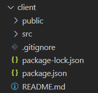
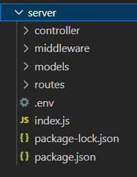
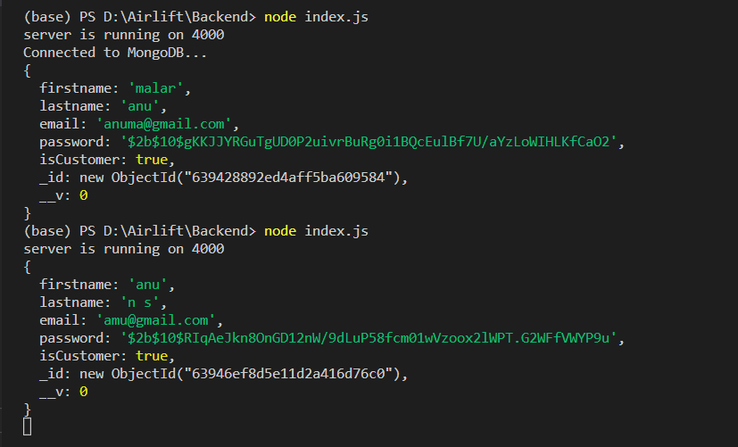
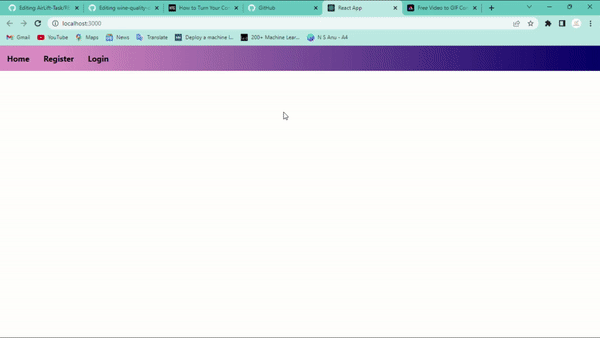
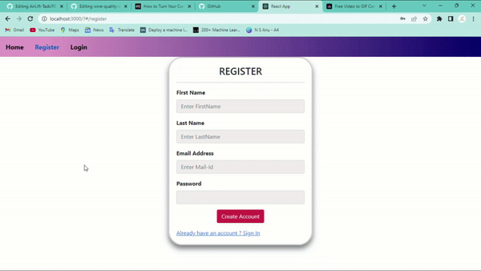

## **AirLift-Task**

 

---

## **Software And Tools Requirements :**

---

 

1. [Template](https://colorlib.com/wp/cat/login-forms/)
2. [Github Account](https://github.com "User-Git-Account")
3. [Postman Account](https://www.postman.com/)
4. [VS Code IDE](https://code.visualstudio.com/ "Editor")
5. [Git CLI](https://git-scm.com/book/en/v2/Getting-Started-The-Command-Line "Git Setup")

 

---

## **File Structure :**

---

 

## **FrontEnd :**

---

## **BackEnd :**

---

## **Database :**

 

---

## **Output :**

 

---

## **Home Page :**

 

## **Register Page :**

 

## **Login Page :**

---

